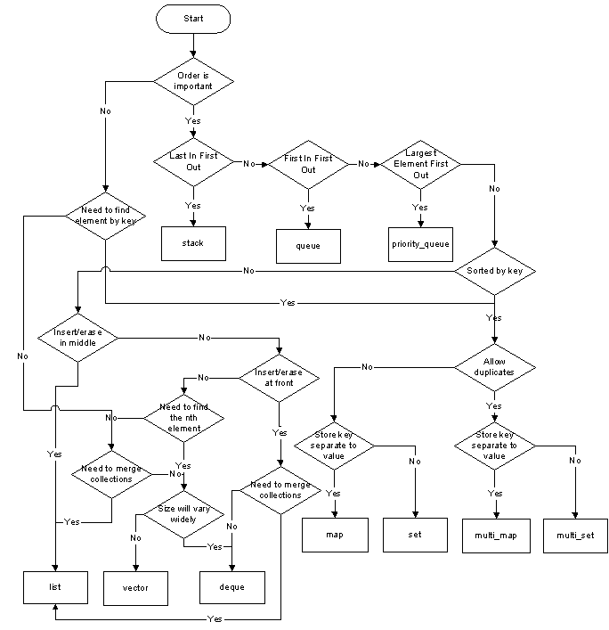

## Links

- <https://isocpp.github.io/CppCoreGuidelines/CppCoreGuidelines>

## `cmake`

### Start `cmake` folder

```sh
CMAKE_FOLDER=build
cmake -G Ninja -DCMAKE_BUILD_TYPE=Debug -S . -B $CMAKE_FOLDER
```

> - `-G` specify a build system generator
> - `Ninja` can be found here [https://ninja-build.org/](https://ninja-build.org/)
> - `-D` create or update a CMake CACHE entry
> - `-S <path>` path to root directory of the CMake project to build
> - `-B <path>` path to directory which CMake will use as the root of build directory
> - reference: [https://cmake.org/cmake/help/latest/manual/cmake.1.html](https://cmake.org/cmake/help/latest/manual/cmake.1.html)

### Build

```sh
CMAKE_FOLDER=build
cmake --build $CMAKE_FOLDER -j "$(nproc)"
```

> - `--build <path>` project binary directory to be built
> - `nproc` print the number of processing units available

## What to use



## cppcheck

- <https://cppcheck.sourceforge.io/>

```sh
# install
apt install cppcheck
# use it
cppcheck --enable=style path/to/file.c
# all checks
cppcheck --enable=all path/to/file.c
```

## Pointers

```cpp
#include <iostream>
#include <memory>

int main() {
    int x = 10;

    // 1. Raw pointer: manually managed
    int* raw = &x;
    std::cout << *raw << '\n'; // 10

    // 2. unique_ptr: one owner
    auto unique = std::make_unique<int>(20);
    std::cout << *unique << '\n'; // 20

    // Transfer ownership
    auto unique2 = std::move(unique);
    // unique is now nullptr
    std::cout << *unique2 << '\n'; // 20

    // 3. shared_ptr: shared ownership
    auto shared1 = std::make_shared<int>(30);
    auto shared2 = shared1; // Both share ownership
    std::cout << *shared1 << '\n'; // 30
    std::cout << shared1.use_count() << '\n'; // 2

    // 4. weak_ptr: observes without owning
    std::weak_ptr<int> weak = shared1;

    if (auto locked = weak.lock()) {
        std::cout << *locked << '\n'; // 30
    }

    shared1.reset(); // manually release ownership - for the example of weak expired
    std::cout << shared2.use_count() << '\n'; // 1
    shared2.reset(); // manually release ownership - for the example of weak expired

    // Object is destroyed; weak_ptr does not keep it alive
    std::cout << std::boolalpha << weak.expired() << '\n'; // true
}
```

## Rule of 3, 5 and 0

```cpp
#include <algorithm>
#include <iostream>
#include <memory>

// Rule of 3: destructor, copy constructor, copy assignment
class RuleOf3 {
    int* data;

public:
    explicit RuleOf3(int value) : data(new int(value)) {}

    ~RuleOf3() { delete data; }

    // Deep copy constructor
    RuleOf3(const RuleOf3& other)
        : data(new int(*other.data)) {}

    // Deep copy assignment
    RuleOf3& operator=(const RuleOf3& other) {
        if (this != &other)
            *data = *other.data;
        return *this;
    }
};

// Rule of 5: Rule of 3 + move constructor + move assignment
class RuleOf5 {
    int* data;

public:
    explicit RuleOf5(int value) : data(new int(value)) {}

    ~RuleOf5() { delete data; }

    RuleOf5(const RuleOf5& other)
        : data(new int(*other.data)) {}

    RuleOf5& operator=(const RuleOf5& other) {
        if (this != &other)
            *data = *other.data;
        return *this;
    }

    // Transfer ownership
    RuleOf5(RuleOf5&& other) noexcept : data(other.data) {
        other.data = nullptr;
    }

    // Transfer ownership and release old resource
    RuleOf5& operator=(RuleOf5&& other) noexcept {
        if (this != &other) {
            delete data;
            data = other.data;
            other.data = nullptr;
        }
        return *this;
    }
};

// Rule of 0: let standard library types manage resources
class RuleOf0 {
    std::unique_ptr<int> data;

public:
    explicit RuleOf0(int value)
        : data(std::make_unique<int>(value)) {}

    // No custom destructor, copy/move operations needed.
    // unique_ptr automatically manages the resource.
    // Copying is disabled; moving is generated automatically.
};
```

